---
{"dg-publish":true,"permalink":"/99-index-and-metadata/hobbes-index-and-links/","title":"Hobbes — Index & Links","tags":["index","hobbes","political_philosophy","dataview"]}
---

# 🗂️ Hobbes — Index & Links

## 🧭 Overview
This index collects and interlinks all notes related to [[02_People or Entities/Thomas Hobbes\|Thomas Hobbes]], his major works, and conceptual contributions.  
It maps his system from *fear and necessity* to *law and sovereignty*, and traces his legacy through liberal and modern state theory.  

---

## 📘 Primary Source
- [[03_Sources or Texts/Leviathan\|Leviathan]]

---

## 🧠 Core Concepts (01_Topics)

| Concept | Folder | Created |
|:--|:--|:--|
| [[01_Topics/Sovereignty\|Sovereignty]] | 01_Topics | 2025-10-14 |
| [[01_Topics/Social Contract\|Social Contract]] | 01_Topics | 2025-10-14 |
| [[01_Topics/State of Nature\|State of Nature]] | 01_Topics | 2025-10-14 |
| [[01_Topics/Fear and Order\|Fear and Order]] | 01_Topics | 2025-10-14 |
| [[01_Topics/Law, Justice, and Obligation\|Law, Justice, and Obligation]] | 01_Topics | 2025-10-14 |
| [[01_Topics/Necessità (Necessity)\|Necessità (Necessity)]] | 01_Topics | 2025-10-14 |
---

## 🧩 Frameworks & Models (05_Frameworks or Models)
- [[05_Frameworks or Models/Fear–Order–Sovereignty Framework\|Fear–Order–Sovereignty Framework]]
- [[05_Frameworks or Models/Sovereignty and the Modern State\|Sovereignty and the Modern State]]

---

## 🔗 Comparative & Integrated Notes
- [[04_Comparative or Integrated Notes/Hobbes and Machiavelli\|Hobbes and Machiavelli]]
- [[04_Comparative or Integrated Notes/Hobbes and Religion\|Hobbes and Religion]]
- [[04_Comparative or Integrated Notes/Hobbes and Liberalism\|Hobbes and Liberalism]]

---

## 🧭 Navigation Map

```mermaid
graph TD
A["Thomas Hobbes"] --> B["State of Nature"]
B --> C["Fear and Order"]
C --> D["Social Contract"]
D --> E["Sovereignty"]
E --> F["Law, Justice, and Obligation"]
F --> G["Sovereignty and the Modern State"]
B --> H["Necessità (Necessity)"]
E --> I["Hobbes and Religion"]
F --> J["Hobbes and Liberalism"]
H --> K["Hobbes and Machiavelli"]
```

| File                                                                                              | category    | subject_area                                                                                       | date_created     |
| ------------------------------------------------------------------------------------------------- | ----------- | -------------------------------------------------------------------------------------------------- | ---------------- |
| [[01_Topics/Law, Justice, and Obligation\|Law, Justice, and Obligation]]                       | Topic       | <ul><li>Political Philosophy</li><li>Jurisprudence</li><li>Early Modern Thought</li></ul>          | October 14, 2025 |
| [[01_Topics/Social Contract\|Social Contract]]                                                 | Topic       | <ul><li>Political Philosophy</li><li>Early Modern Thought</li><li>State Theory</li></ul>           | October 14, 2025 |
| [[01_Topics/Fear and Order\|Fear and Order]]                                                   | Topic       | <ul><li>Political Philosophy</li><li>Psychology of Politics</li><li>Early Modern Thought</li></ul> | October 14, 2025 |
| [[01_Topics/Sovereignty\|Sovereignty]]                                                         | Topic       | <ul><li>Political Philosophy</li><li>Early Modern Thought</li><li>State Theory</li></ul>           | October 14, 2025 |
| [[01_Topics/Necessità (Necessity)\|Necessità (Necessity)]]                                     | Topic       | <ul><li>Political Philosophy</li><li>Early Modern Thought</li><li>Philosophy of Action</li></ul>   | October 14, 2025 |
| [[01_Topics/State of Nature\|State of Nature]]                                                 | Topic       | <ul><li>Political Philosophy</li><li>Early Modern Thought</li><li>Anthropology</li></ul>           | October 14, 2025 |
| [[04_Comparative or Integrated Notes/Hobbes and Liberalism\|Hobbes and Liberalism]]            | Comparative | <ul><li>Political Philosophy</li><li>Early Modern Thought</li><li>History of Liberalism</li></ul>  | October 14, 2025 |
| [[04_Comparative or Integrated Notes/Hobbes and Religion\|Hobbes and Religion]]                | Comparative | <ul><li>Political Philosophy</li><li>Theology and Politics</li><li>Early Modern Thought</li></ul>  | October 14, 2025 |
| [[04_Comparative or Integrated Notes/Hobbes and Machiavelli\|Hobbes and Machiavelli]]          | Comparative | <ul><li>Political Philosophy</li><li>Intellectual History</li><li>Early Modern Thought</li></ul>   | October 14, 2025 |
| [[05_Frameworks or Models/Fear–Order–Sovereignty Framework\|Fear–Order–Sovereignty Framework]] | Framework   | <ul><li>Political Philosophy</li><li>Early Modern Thought</li><li>Political Psychology</li></ul>   | October 14, 2025 |
| [[05_Frameworks or Models/Sovereignty and the Modern State\|Sovereignty and the Modern State]] | Framework   | <ul><li>Political Philosophy</li><li>Early Modern Thought</li><li>Political Theory</li></ul>       | October 14, 2025 |

{ .block-language-dataview}

<table class="dataview table-view-table"><thead class="table-view-thead"><tr class="table-view-tr-header"><th class="table-view-th">Note25</th><th class="table-view-th">Category</th><th class="table-view-th">Subject Area</th><th class="table-view-th">Created</th></tr></thead><tbody class="table-view-tbody"><tr><td><a data-tooltip-position="top" aria-label="01_Topics/Law, Justice, and Obligation.md" data-href="01_Topics/Law, Justice, and Obligation.md" href="01_Topics/Law, Justice, and Obligation.md" class="internal-link" target="_blank" rel="noopener nofollow">Law, Justice, and Obligation</a></td><td>Topic</td><td><ul class="dataview dataview-ul dataview-result-list-ul"><li class="dataview-result-list-li">Political Philosophy</li><li class="dataview-result-list-li">Jurisprudence</li><li class="dataview-result-list-li">Early Modern Thought</li></ul></td><td>October 14, 2025</td></tr><tr><td><a data-tooltip-position="top" aria-label="01_Topics/Social Contract.md" data-href="01_Topics/Social Contract.md" href="01_Topics/Social Contract.md" class="internal-link" target="_blank" rel="noopener nofollow">Social Contract</a></td><td>Topic</td><td><ul class="dataview dataview-ul dataview-result-list-ul"><li class="dataview-result-list-li">Political Philosophy</li><li class="dataview-result-list-li">Early Modern Thought</li><li class="dataview-result-list-li">State Theory</li></ul></td><td>October 14, 2025</td></tr><tr><td><a data-tooltip-position="top" aria-label="01_Topics/Jus ad Bellum (Just Causes of War).md" data-href="01_Topics/Jus ad Bellum (Just Causes of War).md" href="01_Topics/Jus ad Bellum (Just Causes of War).md" class="internal-link" target="_blank" rel="noopener nofollow">Jus ad Bellum (Just Causes of War)</a></td><td>Topic</td><td><ul class="dataview dataview-ul dataview-result-list-ul"><li class="dataview-result-list-li">Political Philosophy</li><li class="dataview-result-list-li">Legal Theory</li><li class="dataview-result-list-li">International Relations</li></ul></td><td>October 15, 2025</td></tr><tr><td><a data-tooltip-position="top" aria-label="01_Topics/Virtù and Fortuna.md" data-href="01_Topics/Virtù and Fortuna.md" href="01_Topics/Virtù and Fortuna.md" class="internal-link" target="_blank" rel="noopener nofollow">Virtù and Fortuna</a></td><td>Topic</td><td><ul class="dataview dataview-ul dataview-result-list-ul"><li class="dataview-result-list-li">Political Philosophy</li><li class="dataview-result-list-li">Renaissance Thought</li></ul></td><td>October 14, 2025</td></tr><tr><td><a data-tooltip-position="top" aria-label="01_Topics/Modern Natural Law (MNL).md" data-href="01_Topics/Modern Natural Law (MNL).md" href="01_Topics/Modern Natural Law (MNL).md" class="internal-link" target="_blank" rel="noopener nofollow">Modern Natural Law (MNL)</a></td><td>Topic</td><td><ul class="dataview dataview-ul dataview-result-list-ul"><li class="dataview-result-list-li">Political Philosophy</li><li class="dataview-result-list-li">Legal Theory</li><li class="dataview-result-list-li">Early Modern Thought</li></ul></td><td>October 15, 2025</td></tr><tr><td><a data-tooltip-position="top" aria-label="01_Topics/Fear and Order.md" data-href="01_Topics/Fear and Order.md" href="01_Topics/Fear and Order.md" class="internal-link" target="_blank" rel="noopener nofollow">Fear and Order</a></td><td>Topic</td><td><ul class="dataview dataview-ul dataview-result-list-ul"><li class="dataview-result-list-li">Political Philosophy</li><li class="dataview-result-list-li">Psychology of Politics</li><li class="dataview-result-list-li">Early Modern Thought</li></ul></td><td>October 14, 2025</td></tr><tr><td><a data-tooltip-position="top" aria-label="01_Topics/Political Realism.md" data-href="01_Topics/Political Realism.md" href="01_Topics/Political Realism.md" class="internal-link" target="_blank" rel="noopener nofollow">Political Realism</a></td><td>Topic</td><td><ul class="dataview dataview-ul dataview-result-list-ul"><li class="dataview-result-list-li">Political Philosophy</li><li class="dataview-result-list-li">Political Theory</li><li class="dataview-result-list-li">International Relations</li></ul></td><td>October 14, 2025</td></tr><tr><td><a data-tooltip-position="top" aria-label="01_Topics/Jus in Bello (Conduct in War).md" data-href="01_Topics/Jus in Bello (Conduct in War).md" href="01_Topics/Jus in Bello (Conduct in War).md" class="internal-link" target="_blank" rel="noopener nofollow">Jus in Bello (Conduct in War)</a></td><td>Topic</td><td><ul class="dataview dataview-ul dataview-result-list-ul"><li class="dataview-result-list-li">Political Philosophy</li><li class="dataview-result-list-li">Legal Theory</li><li class="dataview-result-list-li">International Relations</li></ul></td><td>October 15, 2025</td></tr><tr><td><a data-tooltip-position="top" aria-label="01_Topics/Sovereignty.md" data-href="01_Topics/Sovereignty.md" href="01_Topics/Sovereignty.md" class="internal-link" target="_blank" rel="noopener nofollow">Sovereignty</a></td><td>Topic</td><td><ul class="dataview dataview-ul dataview-result-list-ul"><li class="dataview-result-list-li">Political Philosophy</li><li class="dataview-result-list-li">Early Modern Thought</li><li class="dataview-result-list-li">State Theory</li></ul></td><td>October 14, 2025</td></tr><tr><td><a data-tooltip-position="top" aria-label="01_Topics/Crisis of Christendom.md" data-href="01_Topics/Crisis of Christendom.md" href="01_Topics/Crisis of Christendom.md" class="internal-link" target="_blank" rel="noopener nofollow">Crisis of Christendom</a></td><td>Topic</td><td><ul class="dataview dataview-ul dataview-result-list-ul"><li class="dataview-result-list-li">Political Philosophy</li><li class="dataview-result-list-li">Intellectual History</li><li class="dataview-result-list-li">Religion and Politics</li></ul></td><td>October 14, 2025</td></tr><tr><td><a data-tooltip-position="top" aria-label="01_Topics/Necessità (Necessity).md" data-href="01_Topics/Necessità (Necessity).md" href="01_Topics/Necessità (Necessity).md" class="internal-link" target="_blank" rel="noopener nofollow">Necessità (Necessity)</a></td><td>Topic</td><td><ul class="dataview dataview-ul dataview-result-list-ul"><li class="dataview-result-list-li">Political Philosophy</li><li class="dataview-result-list-li">Early Modern Thought</li><li class="dataview-result-list-li">Philosophy of Action</li></ul></td><td>October 14, 2025</td></tr><tr><td><a data-tooltip-position="top" aria-label="01_Topics/Sovereignty - Internal vs External.md" data-href="01_Topics/Sovereignty - Internal vs External.md" href="01_Topics/Sovereignty - Internal vs External.md" class="internal-link" target="_blank" rel="noopener nofollow">Sovereignty - Internal vs External</a></td><td>Topic</td><td><ul class="dataview dataview-ul dataview-result-list-ul"><li class="dataview-result-list-li">Political Philosophy</li><li class="dataview-result-list-li">Legal Theory</li><li class="dataview-result-list-li">International Relations</li></ul></td><td>October 15, 2025</td></tr><tr><td><a data-tooltip-position="top" aria-label="01_Topics/Law of Nations (Jus Gentium).md" data-href="01_Topics/Law of Nations (Jus Gentium).md" href="01_Topics/Law of Nations (Jus Gentium).md" class="internal-link" target="_blank" rel="noopener nofollow">Law of Nations (Jus Gentium)</a></td><td>Topic</td><td><ul class="dataview dataview-ul dataview-result-list-ul"><li class="dataview-result-list-li">Political Philosophy</li><li class="dataview-result-list-li">Legal Theory</li><li class="dataview-result-list-li">International Relations</li></ul></td><td>October 15, 2025</td></tr><tr><td><a data-tooltip-position="top" aria-label="01_Topics/The Modern State (Lo Stato).md" data-href="01_Topics/The Modern State (Lo Stato).md" href="01_Topics/The Modern State (Lo Stato).md" class="internal-link" target="_blank" rel="noopener nofollow">The Modern State (Lo Stato)</a></td><td>Topic</td><td><ul class="dataview dataview-ul dataview-result-list-ul"><li class="dataview-result-list-li">Political Philosophy</li><li class="dataview-result-list-li">Renaissance Thought</li><li class="dataview-result-list-li">State Theory</li></ul></td><td>October 14, 2025</td></tr><tr><td><a data-tooltip-position="top" aria-label="01_Topics/State of Nature.md" data-href="01_Topics/State of Nature.md" href="01_Topics/State of Nature.md" class="internal-link" target="_blank" rel="noopener nofollow">State of Nature</a></td><td>Topic</td><td><ul class="dataview dataview-ul dataview-result-list-ul"><li class="dataview-result-list-li">Political Philosophy</li><li class="dataview-result-list-li">Early Modern Thought</li><li class="dataview-result-list-li">Anthropology</li></ul></td><td>October 14, 2025</td></tr><tr><td><a data-tooltip-position="top" aria-label="04_Comparative or Integrated Notes/Hobbes and Liberalism.md" data-href="04_Comparative or Integrated Notes/Hobbes and Liberalism.md" href="04_Comparative or Integrated Notes/Hobbes and Liberalism.md" class="internal-link" target="_blank" rel="noopener nofollow">Hobbes and Liberalism</a></td><td>Comparative</td><td><ul class="dataview dataview-ul dataview-result-list-ul"><li class="dataview-result-list-li">Political Philosophy</li><li class="dataview-result-list-li">Early Modern Thought</li><li class="dataview-result-list-li">History of Liberalism</li></ul></td><td>October 14, 2025</td></tr><tr><td><a data-tooltip-position="top" aria-label="04_Comparative or Integrated Notes/Locke - Property and Empire.md" data-href="04_Comparative or Integrated Notes/Locke - Property and Empire.md" href="04_Comparative or Integrated Notes/Locke - Property and Empire.md" class="internal-link" target="_blank" rel="noopener nofollow">Locke - Property and Empire</a></td><td>Comparative</td><td><ul class="dataview dataview-ul dataview-result-list-ul"><li class="dataview-result-list-li">Political Philosophy</li><li class="dataview-result-list-li">Legal Theory</li><li class="dataview-result-list-li">Colonial Thought</li><li class="dataview-result-list-li">Economic Theory</li></ul></td><td>October 15, 2025</td></tr><tr><td><a data-tooltip-position="top" aria-label="04_Comparative or Integrated Notes/Grotius - and Westphalia.md" data-href="04_Comparative or Integrated Notes/Grotius - and Westphalia.md" href="04_Comparative or Integrated Notes/Grotius - and Westphalia.md" class="internal-link" target="_blank" rel="noopener nofollow">Grotius - and Westphalia</a></td><td>Comparative</td><td><ul class="dataview dataview-ul dataview-result-list-ul"><li class="dataview-result-list-li">Political Philosophy</li><li class="dataview-result-list-li">Legal Theory</li><li class="dataview-result-list-li">International Relations</li></ul></td><td>October 15, 2025</td></tr><tr><td><a data-tooltip-position="top" aria-label="04_Comparative or Integrated Notes/Machiavelli and Alan Ryan’s Interpretation.md" data-href="04_Comparative or Integrated Notes/Machiavelli and Alan Ryan’s Interpretation.md" href="04_Comparative or Integrated Notes/Machiavelli and Alan Ryan’s Interpretation.md" class="internal-link" target="_blank" rel="noopener nofollow">Machiavelli and Alan Ryan’s Interpretation</a></td><td>Comparative</td><td><ul class="dataview dataview-ul dataview-result-list-ul"><li class="dataview-result-list-li">Political Philosophy</li><li class="dataview-result-list-li">Intellectual History</li><li class="dataview-result-list-li">Interpretation</li></ul></td><td>October 14, 2025</td></tr><tr><td><a data-tooltip-position="top" aria-label="04_Comparative or Integrated Notes/Hobbes and Religion.md" data-href="04_Comparative or Integrated Notes/Hobbes and Religion.md" href="04_Comparative or Integrated Notes/Hobbes and Religion.md" class="internal-link" target="_blank" rel="noopener nofollow">Hobbes and Religion</a></td><td>Comparative</td><td><ul class="dataview dataview-ul dataview-result-list-ul"><li class="dataview-result-list-li">Political Philosophy</li><li class="dataview-result-list-li">Theology and Politics</li><li class="dataview-result-list-li">Early Modern Thought</li></ul></td><td>October 14, 2025</td></tr><tr><td><a data-tooltip-position="top" aria-label="04_Comparative or Integrated Notes/Hobbes and Machiavelli.md" data-href="04_Comparative or Integrated Notes/Hobbes and Machiavelli.md" href="04_Comparative or Integrated Notes/Hobbes and Machiavelli.md" class="internal-link" target="_blank" rel="noopener nofollow">Hobbes and Machiavelli</a></td><td>Comparative</td><td><ul class="dataview dataview-ul dataview-result-list-ul"><li class="dataview-result-list-li">Political Philosophy</li><li class="dataview-result-list-li">Intellectual History</li><li class="dataview-result-list-li">Early Modern Thought</li></ul></td><td>October 14, 2025</td></tr><tr><td><a data-tooltip-position="top" aria-label="05_Frameworks or Models/Virtù–Fortuna–Necessità Framework.md" data-href="05_Frameworks or Models/Virtù–Fortuna–Necessità Framework.md" href="05_Frameworks or Models/Virtù–Fortuna–Necessità Framework.md" class="internal-link" target="_blank" rel="noopener nofollow">Virtù–Fortuna–Necessità Framework</a></td><td>Framework</td><td><ul class="dataview dataview-ul dataview-result-list-ul"><li class="dataview-result-list-li">Political Philosophy</li><li class="dataview-result-list-li">Renaissance Thought</li><li class="dataview-result-list-li">Statecraft</li></ul></td><td>October 14, 2025</td></tr><tr><td><a data-tooltip-position="top" aria-label="05_Frameworks or Models/Fear–Order–Sovereignty Framework.md" data-href="05_Frameworks or Models/Fear–Order–Sovereignty Framework.md" href="05_Frameworks or Models/Fear–Order–Sovereignty Framework.md" class="internal-link" target="_blank" rel="noopener nofollow">Fear–Order–Sovereignty Framework</a></td><td>Framework</td><td><ul class="dataview dataview-ul dataview-result-list-ul"><li class="dataview-result-list-li">Political Philosophy</li><li class="dataview-result-list-li">Early Modern Thought</li><li class="dataview-result-list-li">Political Psychology</li></ul></td><td>October 14, 2025</td></tr><tr><td><a data-tooltip-position="top" aria-label="05_Frameworks or Models/Natural Law - Sovereignty Framework (Europe &amp; Empire).md" data-href="05_Frameworks or Models/Natural Law - Sovereignty Framework (Europe &amp; Empire).md" href="05_Frameworks or Models/Natural Law - Sovereignty Framework (Europe &amp; Empire).md" class="internal-link" target="_blank" rel="noopener nofollow">Natural Law - Sovereignty Framework (Europe &amp; Empire)</a></td><td>Framework</td><td><ul class="dataview dataview-ul dataview-result-list-ul"><li class="dataview-result-list-li">Political Philosophy</li><li class="dataview-result-list-li">Legal Theory</li><li class="dataview-result-list-li">International Relations</li></ul></td><td>October 15, 2025</td></tr><tr><td><a data-tooltip-position="top" aria-label="05_Frameworks or Models/Sovereignty and the Modern State.md" data-href="05_Frameworks or Models/Sovereignty and the Modern State.md" href="05_Frameworks or Models/Sovereignty and the Modern State.md" class="internal-link" target="_blank" rel="noopener nofollow">Sovereignty and the Modern State</a></td><td>Framework</td><td><ul class="dataview dataview-ul dataview-result-list-ul"><li class="dataview-result-list-li">Political Philosophy</li><li class="dataview-result-list-li">Early Modern Thought</li><li class="dataview-result-list-li">Political Theory</li></ul></td><td>October 14, 2025</td></tr></tbody></table>
